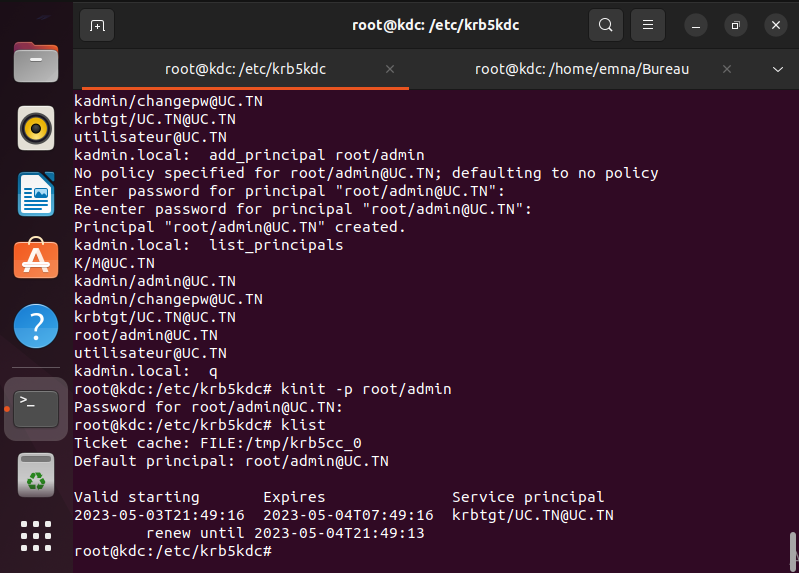
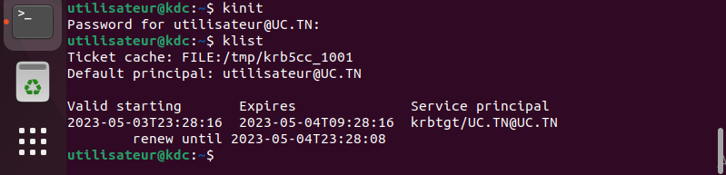
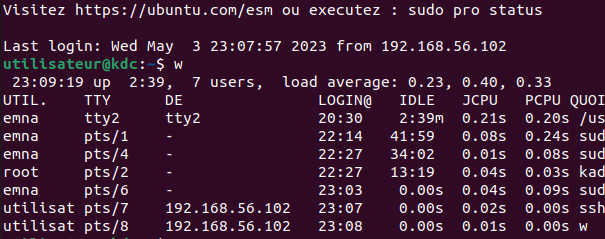
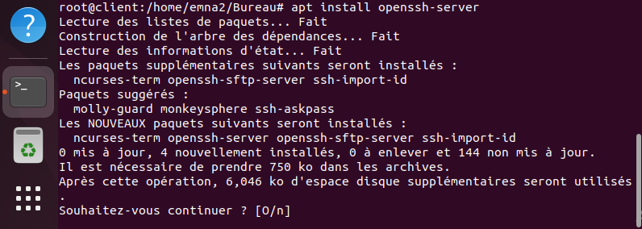
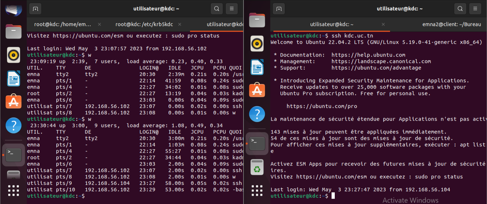

# SSH Authenfication with Kerberos
Using two machines to authenticate a client to an SSH service using a TGT ticket given by a KDC.
Enabling GSSAPI / Kerberos authentication in SSH service will allow ***single-sign-on*** .

## Steps To Setup Kerberos On UBUNTU

Kerberos is a network *authentication protocol* used to verify the identity of two or more *trusted hosts* across an *untrusted network*. It uses *secret-key cryptography* and a *trusted third party* (Kerberos Key Distribution Center) for authenticating client-server applications. Key Distribution Cente (KDC) gives clients tickets representing their network credentials. The Kerberos ticket is presented to the servers after the connection has been established.


*!! Since Kerberos protocol has a timestamp involved, all three machines clocks need to be synchronized.*

### Hostname and IP Addresses

We will need two virtual machines inside of VirtualBox.First machine will be the client and the other machine will be the KDC.
Virtual machines have a NAT adapter by default but in order to **assign IP addresses** to these machines we will need to add a **host-only adapter** manually.
Let's start by creating a new virtual machine.


And don't forget to enable the *DHCP Server*.
Now it's time to connect these virtual machines to our new virtual network.
Go to the *Settings* of each of the virtual machines and under *Network* enable a second adapter :


Specify the type of the adapter (*host-only adapater*) and the virtual network to connect to (newly created).

We can check the IP addresses of all three machines by running `hostname -I` in each one.

In my case :
* Client machine ip address is **192.168.56.104**
* KDC machine (the other virtual machine) ip address is **192.168.56.102**
Now that we added ip addresses to the virtual machines, we will start by setting hostnames for each machine :
And *open a new terminal for changes to take effect.*
*We can check the hostname of a machine by running the command : `hostname`*
* Client machine      

* KDC machine       

Next, we will be mapping these hostnames to their corresponding IP addresses on all three machines using */etc/hosts* file. <br> 
  `sudo vi /etc/hosts`
  
Now, we should set below information to */etc/hosts* **for all three machines** :

    <KDC_IP_ADDRESS>    kdc.uc.tn       kdc
    <CLIENT_ADDRESS>    client.uc.tn    client


Once the setup is done, we can check if everything is working fine by using the `nslookup` command to **query the DNS** to obtain the mapping we just did and the `ping` command.

This an example in the client machine :


### Key Distribution Center Machine Configuration

Following are the packages that need to installed on the KDC machine : <br>
 ```
    $ sudo apt-get update
    $ sudo apt-get install krb5-kdc krb5-admin-server krb5-config
 ```
 
During the installation, we will be asked for configuration of :

 * the realm : 'UC.TN' (must be *all uppercase*)


 * the Kerberos server : 'kdc.uc.tn'


 * the administrative server : 'kdc.uc.tn'

 
***Realm** is a logical network, similar to a domain, that all the users and servers sharing the same Kerberos database belong to.* 

The master key for this KDC database needs to be set once the installation is complete :
   
```
sudo krb5_newrealm
```

**Install and configuration of openssh on the KDC machine**

 ```
   $ sudo apt-get install openssh-server
```
**Create a principal for the client**
*The users and services in a realm are defined as a **principal** in Kerberos.* These principals are managed by an *admin user* that we need to create manually :

```
    $ sudo kadmin.local
    kadmin.local:  add_principal root/admin
```


[kadmin.local] is a KDC database administration program. We used this tool to create a new principal in the UC.TN realm (`add_principal`).

We can check if the user *root/admin* was successfully created by running the command : `kadmin.local: list_principals`. We should see the 'root/admin@UC.TN' principal listed along with other default principals.


Next, we need to grant all access rights to the Kerberos database to admin principal *root/admin* using the configuration file */etc/krb5kdc/kadm5.acl* . <br>
 `sudo vi /etc/krb5kdc/kadm5.acl`

In this file, we need to add the following line :

    */admin@UC.TN    *

For changes to take effect, we need to restart the following service : `sudo service krb5-admin-server restart`

Once the admin user who manages principals is created, we need to create the principal .

```
    $ sudo kadmin.local
    kadmin.local:  add_principal utilisateur
```


We need to add kadmin/admin to the keytab file .

```
    kadmin.local: ktadd -k /etc/krb5kdc/kadm5.keytab kadmin/admin
```
We add kadmin/changepw to the keytab file the same way .

```
    kadmin.local: ktadd -k /etc/krb5kdc/kadm5.keytab kadmin/changepw
```


Now we need to create the service principle .

```
    kadmin.local: addprinc -randkey host/kdc.uc.tn
```
We have to add the service principal to our keytab .

```
    kadmin.local: ktadd host/kdc.uc.tn
```


**Create a user**
```
    sudo su   
 add user utilisateur
```

We will be asked to provide a password for this user.


Now we will access our user by ruuning:
`su -l utilisateur`

Next we will attribute a ticket for this user by running :
`kinit`



Now when we try to access KDC by running:
`ssh kdc.uc.tn`
We are allowed to do so without providing the password

## Client machine

**Installation and configuration of Kerberos on the client machine**

We do  the same configuration already done in the kdc machine 

**Installation of openssh on the client machine**

First we start by installing the openssh package



Next we need to access the sshd_config and ssh_config files 


We have to uncomment GSSAPIAuthentication yes and GSSAPICleanupCredentials yes on the sshd_config file and GSSAPIAuthentication yes and GSSAPIDelegateCredentials yes    on the ssh_config.
Then we save and  restart.

**Create a user for the client machine**

 ```
 sudo su  
 add user utilisateur
 ```
We will be asked to provide a password for this user.

Now we will access our user by ruuning:

`su -l utilisateur`

Next we will attribute a ticket for this user on the client machine by running :

`kinit`

**Accessing the kdc machine**

we run the command:

`ssh kdc.uc.tn`

We can now access the kdc machine from the client machine :



To make sure that the two machines are communicating perfectly, we created a file in the  kdc machine where we echoed the hostname and then we tried to get the file from the client machine It was possible without the need of the user password .

